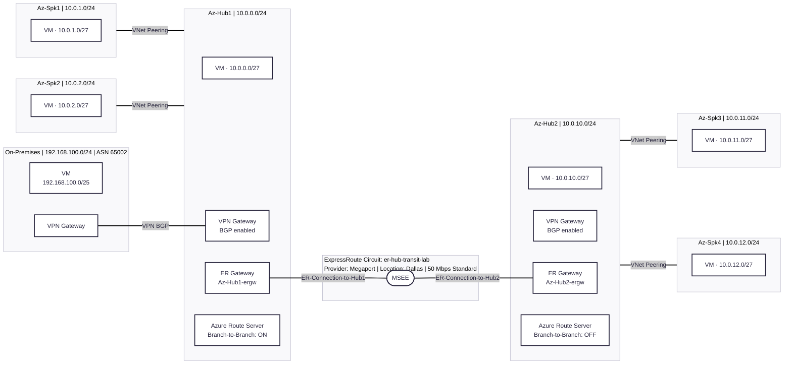

# ExpressRoute Hub Transit Lab

## Overview

This lab deploys two independent hub-and-spoke environments in Azure (**Az-Hub1** and **Az-Hub2**) and connects them via a shared ExpressRoute circuit. The ExpressRoute circuit acts as a transit path between the two hubs — traffic from workloads in Hub1's spokes can reach workloads in Hub2's spokes by hairpinning through the Microsoft Enterprise Edge (MSEE), without requiring direct VNet peering between the hubs.

An on-premises network is also emulated (or connected) via a VPN BGP tunnel into Az-Hub1, with Azure Route Server Branch-to-Branch enabled so that on-premises routes are propagated across the ExpressRoute transit to Hub2.

## Network Diagram



## Address Space

| Resource | Name | Address Space |
|----------|------|---------------|
| Hub1 VNet | Az-Hub1 | 10.0.0.0/24 |
| Hub1 subnet1 | subnet1 | 10.0.0.0/27 |
| Hub1 Gateway subnet | GatewaySubnet | 10.0.0.32/27 |
| Hub1 Route Server subnet | RouteServerSubnet | 10.0.0.128/27 |
| Spoke 1 VNet | Az-Spk1 | 10.0.1.0/24 |
| Spoke 2 VNet | Az-Spk2 | 10.0.2.0/24 |
| Hub2 VNet | Az-Hub2 | 10.0.10.0/24 |
| Hub2 subnet1 | subnet1 | 10.0.10.0/27 |
| Hub2 Gateway subnet | GatewaySubnet | 10.0.10.32/27 |
| Hub2 Route Server subnet | RouteServerSubnet | 10.0.10.128/27 |
| Spoke 3 VNet | Az-Spk3 | 10.0.11.0/24 |
| Spoke 4 VNet | Az-Spk4 | 10.0.12.0/24 |
| On-Premises VNet | OnPrem | 192.168.100.0/24 |

## Components

| Component | Hub1 | Hub2 |
|-----------|------|------|
| VPN Gateway (BGP) | Yes | Yes |
| ExpressRoute Gateway | Yes (`Az-Hub1-ergw`) | Yes (`Az-Hub2-ergw`) |
| Azure Route Server | Yes — Branch-to-Branch **enabled** | Yes — Branch-to-Branch **disabled** |
| Spoke VNets | Az-Spk1, Az-Spk2 | Az-Spk3, Az-Spk4 |

> **Note:** Branch-to-Branch is enabled on Hub1's Route Server so that on-premises VPN routes are re-advertised into the ExpressRoute path, enabling on-premises → Hub2 reachability via transit.

## Prerequisites

- An active Azure subscription.
- An ExpressRoute provider account capable of provisioning a circuit at the **Dallas** peering location via **Megaport** (or update `cxlocation` and `provider` in the script to match your provider).

## Deployment Steps

### Step 1 — Deploy Hub1 and Hub2

```bash
az group create --name er-hub-transit-lab --location centralus --output none

az deployment group create --name Hub1-centralus --resource-group er-hub-transit-lab \
  --template-uri https://raw.githubusercontent.com/dmauser/azure-hub-spoke-base-lab/main/azuredeploy.json \
  --parameters https://raw.githubusercontent.com/dmauser/azure-hub-spoke/main/er-hub-transit/parameters1.json \
  --no-wait

az deployment group create --name Hub2-centralus --resource-group er-hub-transit-lab \
  --template-uri https://raw.githubusercontent.com/dmauser/azure-hub-spoke-base-lab/main/azuredeploy.json \
  --parameters https://raw.githubusercontent.com/dmauser/azure-hub-spoke/main/er-hub-transit/parameters2.json \
  --no-wait
```

> You will be prompted for `VmAdminUsername` and `VmAdminPassword` twice (once per hub deployment).

### Step 2 — Create the ExpressRoute Circuit

Run after both hub deployments succeed. Update `cxlocation` and `provider` if not using Megaport/Dallas.

```bash
az network express-route create \
  --bandwidth 50 -n er-hub-transit-lab \
  --peering-location Dallas -g er-hub-transit-lab \
  --provider Megaport -l centralus \
  --sku-family MeteredData --sku-tier Standard -o none
```

### Step 3 — Provision the Circuit with Your Provider

Retrieve the service key:

```bash
az network express-route show -n er-hub-transit-lab -g er-hub-transit-lab --query serviceKey -o tsv
```

Provide this key to your ExpressRoute provider. The script will poll until `serviceProviderProvisioningState` reaches `Provisioned`.

### Step 4 — Connect Both Hubs to the ExpressRoute Circuit

```bash
erid=$(az network express-route show -n er-hub-transit-lab -g er-hub-transit-lab --query id -o tsv)

az network vpn-connection create --name ER-Connection-to-Hub1 \
  --resource-group er-hub-transit-lab --vnet-gateway1 Az-Hub1-ergw \
  --express-route-circuit2 $erid --routing-weight 0 --output none

az network vpn-connection create --name ER-Connection-to-Hub2 \
  --resource-group er-hub-transit-lab --vnet-gateway1 Az-Hub2-ergw \
  --express-route-circuit2 $erid --routing-weight 0 --output none
```

Or run the full automated script:

```bash
source deploy.azcli
```

## Files

| File | Description |
|------|-------------|
| [deploy.azcli](./deploy.azcli) | Full end-to-end deployment script |
| [parameters1.json](./parameters1.json) | ARM parameters for Hub1 (Az-Hub1, Az-Spk1, Az-Spk2, On-Premises) |
| [parameters2.json](./parameters2.json) | ARM parameters for Hub2 (Az-Hub2, Az-Spk3, Az-Spk4) |
| [diagram.mmd](./diagram.mmd) | Mermaid source for the network diagram above |
