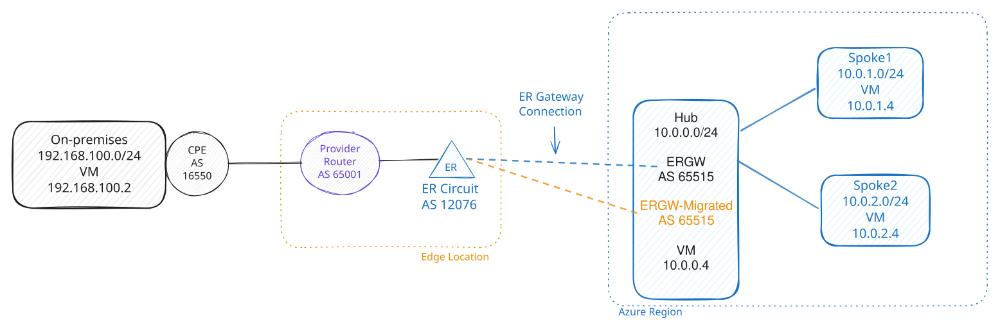

# ExpressRoute Gateway Migration Lab

A hands-on lab that builds an Azure hub-and-spoke network connected to a **GCP-simulated on-premises site** over **Azure ExpressRoute** and a **Megaport** cross-connect, then demonstrates the **[Azure managed ExpressRoute gateway migration](https://learn.microsoft.com/azure/expressroute/gateway-migration)** experience end to end.

The environment is fully described in Terraform (`terraform/`). One-command deploy scripts (`scripts/deploy.ps1` and `scripts/deploy.sh`) orchestrate the multi-stage rollout — including the manual Megaport step and the provider-side provisioning wait — so the lab comes up reliably every time. The original imperative `az`/`gcloud`/shell scripts are preserved in `archive/` for reference.

---

## Table of contents

- [Goals: what you'll learn](#goals-what-youll-learn)
- [Architecture](#architecture)
  - [Topology at a glance](#topology-at-a-glance)
  - [The end-to-end data path](#the-end-to-end-data-path)
  - [Control plane: BGP and ASNs](#control-plane-bgp-and-asns)
  - [Why the GatewaySubnet is a `/26`](#why-the-gatewaysubnet-is-a-26)
  - [Address plan](#address-plan)
  - [ASN plan](#asn-plan)
- [Repository layout](#repository-layout)
- [Prerequisites and installation](#prerequisites-and-installation)
- [Deploying the lab](#deploying-the-lab)
  - [Option A — Automated end-to-end (recommended)](#option-a--automated-end-to-end-recommended)
  - [Option B — Manual, staged Terraform](#option-b--manual-staged-terraform)
  - [Deploy scope: Azure-only vs Azure + GCP](#deploy-scope-azure-only-vs-azure--gcp)
  - [The two-phase ExpressRoute connection](#the-two-phase-expressroute-connection)
- [The gateway migration demo](#the-gateway-migration-demo)
- [Measuring migration interruption](#measuring-migration-interruption)
- [Validation](#validation)
- [Troubleshooting](#troubleshooting)
- [Learning by doing: Azure Portal walkthrough](#learning-by-doing-azure-portal-walkthrough)
- [Security and cost notes](#security-and-cost-notes)
- [Credits and archive](#credits-and-archive)

---

## Goals: what you'll learn

ExpressRoute virtual network gateways historically could not be resized or moved to availability-zone-enabled SKUs in place — you had to delete and recreate them, taking an outage. Azure now offers a **managed gateway migration** that prepares a new gateway alongside the existing one, copies the configuration and connections, and cuts over with minimal disruption. This lab gives you a complete, realistic environment to practice that migration safely.

By completing this lab you will:

1. **Stand up a production-shaped hybrid network** — an Azure hub-and-spoke topology with two spokes, an ExpressRoute gateway, Azure Bastion, and an ExpressRoute circuit, all peered to a remote "on-premises" site.
2. **Simulate on-premises with Google Cloud** — a GCP VPC, VM, and Cloud Router stand in for a customer datacenter, exchanging routes with Azure over BGP. This keeps the lab self-contained and reproducible without physical hardware.
3. **Provision a real ExpressRoute private peering over Megaport** — you exchange a service key and pairing key in the Megaport portal to build the Layer 2 cross-connect, exactly as you would in production.
4. **Understand the ExpressRoute control and data plane** — how the circuit, private peering, gateway connection, and BGP sessions fit together, and how the Azure hub prefix is advertised to and learned by the simulated on-premises site.
5. **Execute the managed ExpressRoute gateway migration** — validate, prepare, migrate, and commit a gateway move to a new SKU using Azure's managed flow, then confirm the data path survived.
6. **Build deployment discipline for ExpressRoute** — the lab encodes the ordering rules that make ExpressRoute deployments fragile (notably: never create the gateway-to-circuit connection before the provider has provisioned the circuit) into Terraform and the deploy scripts, with validations that catch mistakes early.

---

## Architecture



*📐 Edit this diagram: [open in Excalidraw](https://excalidraw.com/#url=https://raw.githubusercontent.com/dmauser/azure-hub-spoke/main/er-migration/diagrams/diagram.excalidraw) (loads the live `diagram.excalidraw` from `main`) — or download [`diagrams/diagram.excalidraw`](./diagrams/diagram.excalidraw) and open it at [excalidraw.com](https://excalidraw.com).*

### Topology at a glance

The lab is built from four logical building blocks, each implemented as a Terraform module:

| Block | Module | What it represents |
| --- | --- | --- |
| **Azure hub** | `module.hub` | `az-hub-vnet` with `subnet1` (workload VM), `GatewaySubnet` (ExpressRoute gateway), and `AzureBastionSubnet`. The hub owns the ExpressRoute gateway and is the transit point for all cross-cloud traffic. |
| **Azure spokes** | `module.spokes` | `az-spk1-vnet` and `az-spk2-vnet`, each with a workload VM, peered to the hub with **gateway transit** so they reach on-premises through the hub's ExpressRoute gateway. |
| **ExpressRoute edge** | `module.ergw` | The ExpressRoute **circuit** (`az-hub-er-circuit`), the **gateway** (`az-hub-ergw`), Azure **private peering**, and the **gateway-to-circuit connection**. |
| **Simulated on-premises** | `module.gcp_onprem` | A GCP VPC (`gcp-on-prem-vpc`), VM, firewall, **Cloud Router**, and a **Partner Interconnect VLAN attachment** that terminates the Megaport cross-connect on the GCP side. |

### The end-to-end data path

Traffic between an Azure VM and the simulated on-premises VM traverses six hops:

```
 Azure VM (10.0.x.4)
   │  Azure VNet routing + hub-spoke peering (gateway transit)
   ▼
 ExpressRoute gateway  az-hub-ergw  (GatewaySubnet, ASN 65515)
   │  ExpressRoute gateway-to-circuit connection
   ▼
 ExpressRoute circuit  az-hub-er-circuit  (Microsoft edge, ASN 12076)
   │  Azure private peering  (BGP over /30 link subnets)
   ▼
 Megaport  (managed Layer 2 cross-connect / VXC, provider ASN 65001)
   │  Partner Interconnect
   ▼
 GCP Partner Interconnect VLAN attachment + Cloud Router (ASN 16550)
   │  GCP VPC routing
   ▼
 GCP "on-prem" VM (192.168.100.2)
```

Megaport sits in the middle as a **managed Layer 2 provider**: it stitches the Azure ExpressRoute circuit to the GCP Partner Interconnect attachment. Because Megaport manages that layer, it **auto-creates the Azure private peering** on the circuit when the VXC provisions — so in this lab Terraform manages the gateway-to-circuit **connection** but does **not** recreate the peering (see [The two-phase ExpressRoute connection](#the-two-phase-expressroute-connection)).

### Control plane: BGP and ASNs

Reachability is driven entirely by BGP. Each side advertises its own prefixes and learns the other's:

- **Azure → on-premises:** the hub (`10.0.0.0/24`) and, via gateway transit, the spokes (`10.0.1.0/24`, `10.0.2.0/24`) are advertised through the ExpressRoute gateway and private peering toward Megaport and on to GCP.
- **On-premises → Azure:** GCP advertises `192.168.100.0/24` through its Cloud Router toward Megaport and on to the ExpressRoute circuit.

A healthy lab is one where the **GCP Cloud Router has learned `10.0.0.0/24`** and Azure effective routes show the GCP prefix — that confirms the full path, not just that the link subnets came up. The deploy and validate scripts check exactly this.

### Why the GatewaySubnet is a `/26`

The `GatewaySubnet` is sized **`/26`** (not the bare-minimum `/27` or `/29`) on purpose. The managed gateway migration **temporarily runs two ExpressRoute gateways side by side** in the same `GatewaySubnet` while it copies configuration and connections from the old gateway to the new one. A `/26` guarantees there is address space for the second gateway during the cut-over. Sizing the subnet too small is a common reason managed migration fails to prepare.

### Address plan

| Network | CIDR | Purpose | Notes |
| --- | --- | --- | --- |
| `az-hub-vnet` | `10.0.0.0/24` | Azure hub VNet address space | Contains all hub subnets. |
| `az-hub-vnet/subnet1` | `10.0.0.0/27` | Hub VM subnet | Hub VM static IP is `10.0.0.4`. |
| `az-hub-vnet/GatewaySubnet` | `10.0.0.64/26` | ExpressRoute gateway subnet | Required name: exactly `GatewaySubnet`. Sized `/26` so the temporary second gateway created during managed migration fits. |
| `az-hub-vnet/AzureBastionSubnet` | `10.0.0.192/26` | Azure Bastion subnet | Required name: exactly `AzureBastionSubnet`. |
| `az-spk1-vnet` | `10.0.1.0/24` | Azure spoke 1 VNet | Spoke 1 VM static IP is `10.0.1.4`. |
| `az-spk1-vnet/subnet1` | `10.0.1.0/27` | Spoke 1 VM subnet | Peered to the hub with remote gateway transit enabled. |
| `az-spk2-vnet` | `10.0.2.0/24` | Azure spoke 2 VNet | Spoke 2 VM static IP is `10.0.2.4`. |
| `az-spk2-vnet/subnet1` | `10.0.2.0/27` | Spoke 2 VM subnet | Peered to the hub with remote gateway transit enabled. |
| `gcp-on-prem-vpc` | `192.168.100.0/24` | GCP simulated on-premises VPC/subnet | GCP VM static IP is `192.168.100.2`. |

### ASN plan

| Component | ASN | Notes |
| --- | ---: | --- |
| Azure ExpressRoute gateway `az-hub-ergw` | `65515` | Azure gateway ASN; preserved across managed gateway migration. |
| ExpressRoute circuit (Microsoft edge) | `12076` | Microsoft/ExpressRoute circuit-side ASN for private peering. |
| Provider router / Megaport side | `65001` | Provider/on-prem-side private ASN. |
| GCP Cloud Router | `16550` | GCP-side BGP ASN. |

---

## Repository layout

```text
er-migration/
├── README.md
├── diagrams/
│   └── er-migration.svg
├── archive/                         # original imperative az/gcloud/shell lab (reference only)
│   ├── README.md
│   ├── 1-hub-spk.sh
│   ├── 2-gcp-er.sh
│   ├── 3-add-subnetprefix.sh
│   ├── 4-validation.sh
│   ├── 5-clean-up.sh
│   └── gw-prepare.png
├── scripts/
│   ├── deploy.ps1                   # full end-to-end deploy (Windows / PowerShell)
│   ├── deploy.sh                    # full end-to-end deploy (Linux / Bash)
│   ├── cleanup.ps1                  # full lab teardown (Windows / PowerShell)
│   ├── cleanup.sh                   # full lab teardown (Linux / Bash)
│   ├── deploy-gcp.ps1               # GCP-side-only helper (Windows / PowerShell)
│   ├── ping-monitor.sh              # GCP-side ping monitor for migration interruption (Bash)
│   ├── validate-lab.ps1            # read-only health check (Windows / PowerShell)
│   └── validate-lab.sh             # read-only health check (Linux / Bash)
└── terraform/
    ├── backend.tf
    ├── locals.tf
    ├── main.tf
    ├── outputs.tf
    ├── providers.tf
    ├── terraform.tfvars.example
    ├── variables.tf
    ├── versions.tf
    ├── docs/
    │   ├── address-plan.md
    │   ├── megaport-cross-connect.md
    │   └── portal-walkthrough.md
    └── modules/
        ├── azure-hub/
        ├── azure-spoke/
        ├── azure-ergw/
        └── gcp-onprem/
```

The root Terraform configuration creates the Azure resource group and wires these modules:

- **`module.hub`** — `az-hub-vnet`, hub subnets (`subnet1`, `GatewaySubnet`, `AzureBastionSubnet`), hub NSG, hub Ubuntu VM, and optional Azure Bastion controlled by `deploy_bastion`.
- **`module.spokes`** — `az-spk1-vnet` and `az-spk2-vnet`, spoke subnets, NSGs, Ubuntu VMs, and hub-spoke peerings with gateway transit.
- **`module.ergw`** — ExpressRoute circuit `az-hub-er-circuit`, optional Azure private peering, the single ExpressRoute gateway `az-hub-ergw` (Azure manages the gateway public IP internally for ExpressRoute-type gateways), and the gateway-to-circuit connection that is created only when `er_circuit.private_peering.enabled = true`.
- **`module.gcp_onprem`** — optional GCP VPC, subnet, firewall, VM, Cloud Router, and Partner Interconnect VLAN attachment.

---

## Prerequisites and installation

This lab needs three CLI tools — **Azure CLI (`az`)**, **Terraform (`>= 1.5.0`)**, and (for the GCP side) the **Google Cloud SDK (`gcloud`)** — plus a **Megaport** account to build the cross-connect VXCs.

> Tip: `scripts/deploy.ps1` and `scripts/deploy.sh` check for these tools and offer to install any that are missing.

### Install on Windows (PowerShell)

```powershell
winget install --id Microsoft.AzureCLI -e
winget install --id Hashicorp.Terraform -e
winget install --id Google.CloudSDK -e
```

If `winget` is unavailable, install the Google Cloud SDK portably (no admin): download
`https://dl.google.com/dl/cloudsdk/channels/rapid/downloads/google-cloud-cli-windows-x86_64-bundled-python.zip`,
unzip it, and add `google-cloud-sdk\bin` to your `PATH`.

### Install on Linux (Debian/Ubuntu)

```bash
# Azure CLI
curl -sL https://aka.ms/InstallAzureCLIDeb | sudo bash

# Terraform
wget -O- https://apt.releases.hashicorp.com/gpg | sudo gpg --dearmor -o /usr/share/keyrings/hashicorp-archive-keyring.gpg
echo "deb [signed-by=/usr/share/keyrings/hashicorp-archive-keyring.gpg] https://apt.releases.hashicorp.com $(lsb_release -cs) main" | sudo tee /etc/apt/sources.list.d/hashicorp.list
sudo apt-get update && sudo apt-get install -y terraform

# Google Cloud SDK
curl https://packages.cloud.google.com/apt/doc/apt-key.gpg | sudo gpg --dearmor -o /usr/share/keyrings/cloud.google.gpg
echo "deb [signed-by=/usr/share/keyrings/cloud.google.gpg] https://packages.cloud.google.com/apt cloud-sdk main" | sudo tee /etc/apt/sources.list.d/google-cloud-sdk.list
sudo apt-get update && sudo apt-get install -y google-cloud-cli
```

### Authenticate

```bash
az login                                  # Azure
gcloud auth login                         # GCP user login (GCP side only)
gcloud auth application-default login     # GCP Application Default Credentials used by Terraform
```

### Accounts and permissions

- Azure subscription with rights to create VNet, ExpressRoute gateway, Bastion, and VM resources.
- (GCP side) GCP project with **billing enabled** and the **Compute Engine API**, plus permissions for Compute Engine, Cloud Router, and Partner Interconnect.
- Megaport account with permission to create VXCs for the manual cross-connect.
- Budget approval: ExpressRoute circuits, gateways, Bastion, VMs, public IPs, Megaport VXCs, and GCP resources incur real charges.

---

## Deploying the lab

The lab deploys in two phases separated by a **manual Megaport step**: Terraform builds the infrastructure and emits a circuit service key (and a GCP pairing key); you create the VXCs in the Megaport portal; then the gateway-to-circuit connection is enabled once the provider has provisioned the circuit. You can let a script orchestrate all of this, or run the phases by hand.

### Option A — Automated end-to-end (recommended)

The deploy scripts run the whole flow: prerequisite checks, authentication, password confirmation, `terraform apply`, printing the Megaport keys, **pausing for the manual Megaport step**, polling the circuit until the provider reports `Provisioned`, enabling the connection and re-applying, then validating that BGP is up and the Azure prefix reached GCP.

**Windows (PowerShell):**

```powershell
cd er-migration\scripts
./deploy.ps1 -GcpProject <your-gcp-project>
# Azure-only:
./deploy.ps1 -SkipGcp
```

**Linux (Bash):**

```bash
cd er-migration/scripts
./deploy.sh --gcp-project <your-gcp-project>
# Azure-only:
./deploy.sh --skip-gcp
```

When the script pauses, switch to the Megaport portal, create the VXCs using the printed **ExpressRoute service key** and **GCP pairing key** (see [`terraform/docs/megaport-cross-connect.md`](./terraform/docs/megaport-cross-connect.md)), then return to the script. It waits for the provider state and finishes automatically.

### Option B — Manual, staged Terraform

From `er-migration/terraform`:

```powershell
terraform init
terraform plan  -var "admin_password=<strong-pwd>"
terraform apply -var "admin_password=<strong-pwd>"
```

Read the keys after apply:

```powershell
terraform output -raw expressroute_circuit_service_key
terraform output -raw gcp_pairing_key
```

Use the **service key** for the Azure Megaport VXC and the **pairing key** for the GCP Partner Interconnect VXC. After the Megaport VXCs provision and the circuit shows `serviceProviderProvisioningState = Provisioned`, enable the connection (next section) and re-apply.

Or copy `terraform.tfvars.example` to `terraform.tfvars`, set `admin_password`, `gcp_project`, and `gcp_onprem.deploy_gcp`, then `terraform plan` / `terraform apply`.

### Deploy scope: Azure-only vs Azure + GCP

The `gcp_onprem.deploy_gcp` flag selects what gets built:

- **Azure-only validation** — `gcp_onprem.deploy_gcp = false`. Builds the Azure hub, spokes, circuit, and gateway; `gcp_pairing_key` is `null`.
- **Azure + GCP lab** — `gcp_onprem.deploy_gcp = true` plus `gcp_project`. Also builds the GCP simulated on-premises network and a Partner Interconnect VLAN attachment whose pairing key is used in Megaport.

### The two-phase ExpressRoute connection

This is the single most important ordering rule in the lab, and it is encoded in both Terraform and the scripts:

> **Never create the ExpressRoute gateway-to-circuit connection before the circuit's `serviceProviderProvisioningState` is `Provisioned`.** If you do, Azure returns `ServiceProviderNotProvisioned` and the connection sticks in **`Failed`** — it does not self-heal.

To make this safe, the connection is gated behind `er_circuit.private_peering.enabled`:

1. **Phase 1 (`enabled = false`)** — Terraform builds everything *except* the connection and emits the service key. You provision the Megaport VXC.
2. **Phase 2 (`enabled = true`)** — after the circuit is `Provisioned`, Terraform creates the connection cleanly and tracks it in state.

Because Megaport is a **managed Layer 2 provider**, it auto-creates the Azure **private peering** on the circuit. To avoid a collision, set `create_peering = false` so Terraform manages **only** the connection, not the peering:

```hcl
er_circuit = {
  # ...
  private_peering = {
    enabled        = true   # phase 2: create the gateway-to-circuit connection
    create_peering = false  # Megaport already created the peering — don't recreate it
  }
}
```

The deploy scripts flip `enabled` from `false` to `true` for you after the provider state is `Provisioned`.

---

## The gateway migration demo

The teaching centerpiece is migrating the single ExpressRoute gateway `az-hub-ergw` to a higher or availability-zone-enabled SKU using Azure's managed [ExpressRoute gateway migration](https://learn.microsoft.com/azure/expressroute/gateway-migration). The managed flow:

1. **Validates** the existing gateway and `GatewaySubnet`.
2. **Prepares** a new gateway in the same `GatewaySubnet` (which is why it is sized `/26` — both gateways coexist here during migration).
3. **Migrates** the configuration and connections to the new gateway.
4. **Commits** after you verify connectivity, then deletes the original gateway.

This migration is performed **outside Terraform** — through the Azure portal or the official PowerShell migration scripts — because it is a managed in-place operation. After it completes, update `er_gateway.sku` and `er_gateway.name` (and re-import into Terraform state if needed) so Terraform stays aligned with the migrated gateway.

Roll back by selecting **Abort** after the prepare step and before commit; this deletes the new gateway and keeps the original in service.

---

## Measuring migration interruption

The managed gateway migration prepares a second ExpressRoute gateway in the same `GatewaySubnet` and coordinates the cut-over from the old gateway to the new one. This process is designed to minimize data-plane interruption, but you may want to measure whether and for how long connectivity is actually interrupted. A continuous timestamped ping from the GCP "on-premises" VM targeting the Azure hub VM quantifies this precisely: any data-path drop appears as a sequence of failed ping probes with timestamps and outage duration.

### Monitoring workflow

1. SSH to the GCP "on-prem" VM (`192.168.100.2`).
2. Start the monitoring script (see below) and let it run for ~10 seconds to establish baseline.
3. **In the Azure portal**, initiate the managed ExpressRoute gateway migration on `az-hub-ergw` (Validate → Prepare → Migrate → Commit).
4. Watch the monitor output for `[DOWN]` lines indicating lost connectivity.
5. When the migration completes and connectivity is restored, stop the monitor with **Ctrl+C**.
6. Review the summary: `Probes sent`, `Replies received`, `Lost`, loss percentage, and **`Longest outage`** (in seconds).
7. Copy the timestamped log file (`ping-monitor-YYYYMMDD-HHMMSS.log`) off the VM for your report.

### Using the script

The monitoring script lives in `scripts/ping-monitor.sh` and runs on the GCP "on-prem" VM, pinging the Azure hub VM (`10.0.0.4`) every second. It logs every probe with timestamp, tracks outage windows, and prints a running summary during execution and a final summary when stopped.

**If you have the repo locally:**

```bash
cd scripts
./ping-monitor.sh                              # default: target=10.0.0.4, interval=1s
./ping-monitor.sh 10.0.0.4 -i 1 -l migration.log
```

**To run on the GCP VM without cloning the repo, paste this on the GCP side:**

```bash
cat > ping-monitor.sh << 'SCRIPT_EOF'
#!/usr/bin/env bash
#
# ping-monitor.sh - Continuous, timestamped reachability monitor for the
# ExpressRoute migration lab. Run this ON THE GCP "on-prem" VM during the
# Azure managed ExpressRoute gateway migration to measure whether (and for
# how long) the data path is interrupted.
#
# It pings the Azure hub VM once per second, logs every probe with a
# timestamp, tracks consecutive failures as "outage windows", and prints a
# running + final summary (sent / received / loss %, longest outage).
#
# Usage:
#   ./ping-monitor.sh [TARGET_IP] [-i INTERVAL_SEC] [-l LOGFILE]
#
# Examples:
#   ./ping-monitor.sh                       # ping 10.0.0.4 every 1s
#   ./ping-monitor.sh 10.0.0.4 -i 1 -l migration.log
#
# Stop with Ctrl+C; a final summary is printed and written to the log.
#
# Portability note: %3N (millisecond timestamps) requires GNU coreutils date.
# This is the default on Debian/Ubuntu GCP VMs (iputils-ping, coreutils).
# Busybox date (Alpine) does not support %3N — replace with %S if needed.

set -uo pipefail

TARGET="${1:-10.0.0.4}"
[[ "${TARGET}" == -* ]] && TARGET="10.0.0.4" || shift || true

INTERVAL=1
LOGFILE="ping-monitor-$(date +%Y%m%d-%H%M%S).log"

while [[ $# -gt 0 ]]; do
  case "$1" in
    -i|--interval) INTERVAL="$2"; shift 2 ;;
    -l|--logfile)  LOGFILE="$2"; shift 2 ;;
    -h|--help)
      echo "Usage: $0 [TARGET_IP] [-i INTERVAL_SEC] [-l LOGFILE]"; exit 0 ;;
    *) echo "Unknown option: $1"; exit 1 ;;
  esac
done

sent=0
recv=0
cur_outage=0
max_outage=0
outage_start=""

ts() { date '+%Y-%m-%d %H:%M:%S.%3N'; }

log() { echo "$1" | tee -a "$LOGFILE"; }

summary() {
  local lost=$(( sent - recv ))
  local loss=0
  [[ $sent -gt 0 ]] && loss=$(( lost * 100 / sent ))
  log ""
  log "===================== SUMMARY ====================="
  log "Target           : $TARGET"
  log "Probes sent      : $sent"
  log "Replies received : $recv"
  log "Lost             : $lost (${loss}%)"
  log "Longest outage   : $(( max_outage * INTERVAL ))s  ($max_outage consecutive missed probe(s) x ${INTERVAL}s each)"
  log "Log file         : $LOGFILE"
  log "==================================================="
}

on_exit() {
  # Close any open outage window before summarizing.
  if [[ $cur_outage -gt 0 && -n "$outage_start" ]]; then
    log "$(ts) [STILL-DOWN] script stopped during active outage; started at $outage_start, duration ~$(( cur_outage * INTERVAL ))s (NOT recovered)"
  fi
  summary
  exit 0
}
trap on_exit INT TERM

log "$(ts) [START]   Monitoring $TARGET every ${INTERVAL}s. Logging to $LOGFILE. Press Ctrl+C to stop."
log "$(ts) [START]   Begin the Azure managed gateway migration now; watch for [DOWN] lines."

while true; do
  sent=$(( sent + 1 ))
  if rtt=$(ping -c 1 -W 1 "$TARGET" 2>/dev/null | sed -n 's/.*time=\([0-9.]*\).*/\1/p'); [[ -n "${rtt:-}" ]]; then
    recv=$(( recv + 1 ))
    if [[ $cur_outage -gt 0 ]]; then
      log "$(ts) [UP]      reply from $TARGET time=${rtt}ms  (recovered after ~$(( cur_outage * INTERVAL ))s outage that began $outage_start)"
      cur_outage=0
      outage_start=""
    else
      log "$(ts) [UP]      reply from $TARGET time=${rtt}ms"
    fi
  else
    if [[ $cur_outage -eq 0 ]]; then
      outage_start="$(ts)"
    fi
    cur_outage=$(( cur_outage + 1 ))
    [[ $cur_outage -gt $max_outage ]] && max_outage=$cur_outage
    log "$(ts) [DOWN]    no reply from $TARGET  (outage ~$(( cur_outage * INTERVAL ))s)"
  fi
  sleep "$INTERVAL"
done
SCRIPT_EOF
chmod +x ping-monitor.sh
./ping-monitor.sh
```

---

## Validation

Run a read-only health check of the full data path at any time:

```powershell
# Windows
./scripts/validate-lab.ps1 -GcpProject <your-gcp-project>
```

```bash
# Linux
./scripts/validate-lab.sh --gcp-project <your-gcp-project>
```

The validators check, without changing anything: the circuit is `Provisioned`, the private peering is `Succeeded`, the gateway-to-circuit connection is `Succeeded`, the GCP Cloud Router BGP session is **UP**, and GCP has **learned the Azure hub prefix `10.0.0.0/24`**. They exit `0` when healthy and `1` otherwise, so they double as CI gates.

For Terraform-level checks, from `er-migration/terraform`:

```powershell
terraform fmt -recursive -check
terraform validate
```

---

## Troubleshooting

**Connection `az-hub-ergw-to-az-hub-er-circuit` is in `Failed` state.**
Almost always caused by creating the connection before the circuit was provider-provisioned (`ServiceProviderNotProvisioned`). The connection will not recover on its own. Fix it by deleting the failed connection and letting Terraform recreate it once the circuit is `Provisioned`:

```powershell
# 1) Confirm the circuit is provider-provisioned first
az network express-route show -g lab-er-migration -n az-hub-er-circuit `
  --query serviceProviderProvisioningState -o tsv   # must print: Provisioned

# 2) Remove the stuck connection (it is non-functional anyway)
az network vpn-connection delete -g lab-er-migration -n az-hub-ergw-to-az-hub-er-circuit

# 3) Ensure tfvars enables the connection but not the peering, then re-apply
#    er_circuit.private_peering = { enabled = true, create_peering = false }
cd er-migration\terraform
terraform apply -var "admin_password=<strong-pwd>"

# 4) Verify
./..\scripts\validate-lab.ps1 -GcpProject <your-gcp-project>
```

**GCP only learned the `/30` link subnets, not `10.0.0.0/24`.**
The link is up but end-to-end routing is not. Confirm the connection is `Succeeded` and that the private peering is exchanging the Azure prefixes; re-run the validator after BGP converges.

**`terraform` reports "Too many command line arguments" on Windows.**
PowerShell's native argument parser splits unquoted `-out=...`. Always quote plan-file arguments: `terraform plan "-out=lab.tfplan"`.

**Provider state never reaches `Provisioned`.**
The Megaport VXC has not finished. Re-check the Megaport portal and the circuit `serviceProviderProvisioningState`; the deploy scripts poll this automatically.

---

## Learning by doing: Azure Portal walkthrough

Prefer clicking through the portal to understand each piece before automating it? Follow the step-by-step, portal-first guide that builds the entire lab by hand and then performs the managed gateway migration:

➡️ **[Portal walkthrough (learning by doing)](./terraform/docs/portal-walkthrough.md)**

The Terraform path above remains the fastest way to stand up or tear down the lab.

---

## Security and cost notes

- Do not commit plaintext passwords or local `terraform.tfvars` files. `admin_password` is a required sensitive variable and must be supplied through a secure local mechanism such as `terraform.tfvars`, `TF_VAR_admin_password`, or an interactive prompt.
- The lab VMs use `admin_username` / `admin_password` with password authentication enabled.
- This lab creates real Azure, GCP, and Megaport charges. When finished, use the cleanup scripts to destroy all Terraform-managed resources, then **manually delete the Megaport VXCs** in the [Megaport portal](https://portal.megaport.com) — Terraform cannot destroy portal-created VXCs:

  **Windows (PowerShell):**

  ```powershell
  cd er-migration\scripts
  ./cleanup.ps1 -GcpProject <your-gcp-project>
  # Azure-only:
  ./cleanup.ps1 -SkipGcp
  # Non-interactive (CI/automation):
  ./cleanup.ps1 -GcpProject <your-gcp-project> -Force
  ```

  **Linux (Bash):**

  ```bash
  cd er-migration/scripts
  ./cleanup.sh --gcp-project <your-gcp-project>
  # Azure-only:
  ./cleanup.sh --skip-gcp
  # Non-interactive (CI/automation):
  ./cleanup.sh --gcp-project <your-gcp-project> --force
  ```

  Alternatively, run `terraform destroy` directly from `er-migration/terraform`:

  ```powershell
  cd er-migration\terraform
  terraform destroy -var "admin_password=<strong-pwd>"
  ```

  > **Note:** The cleanup scripts handle an important edge case: the ER gateway connection `az-hub-ergw-to-az-hub-er-circuit` may have been created or recreated directly via `az` during incident remediation and therefore may **not** exist in Terraform state. The scripts delete it explicitly via `az` before running `terraform destroy` so it is not orphaned. They also remind you to delete the Megaport VXCs — see [`terraform/docs/megaport-cross-connect.md`](./terraform/docs/megaport-cross-connect.md) for VXC deletion steps.

---

## Credits and archive

The original imperative lab scripts are preserved in [`archive/`](./archive/) for historical reference. The Terraform rebuild is the authoritative implementation, with address and cross-connect design notes in [`terraform/docs/address-plan.md`](./terraform/docs/address-plan.md) and [`terraform/docs/megaport-cross-connect.md`](./terraform/docs/megaport-cross-connect.md).
