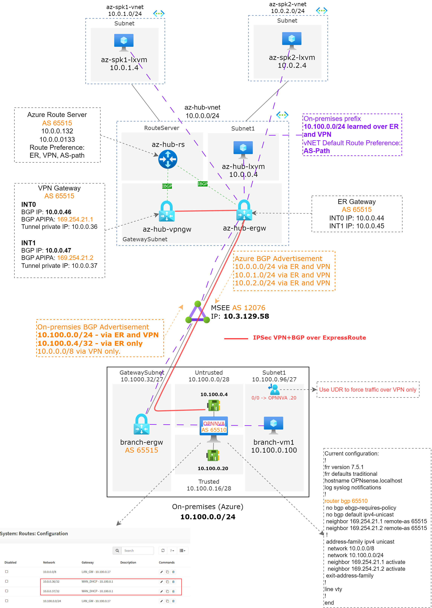

# IPsec over ExpressRoute and ARS Route Preference deep dive (Hub and Spoke)

## Introduction

IPSec VPN over ExpressRoute is a feature in Azure that provides an additional layer of security by encrypting all data that travels over an ExpressRoute circuit. This is achieved by establishing an IPsec/IKE VPN connection from the on-premises network to Azure over the private peering of an Azure ExpressRoute circuit.

This setup allows for secure, encrypted communication between data centers, branch offices, and remote users. It ensures that data transmitted between the on-premises networks and Azure virtual networks over ExpressRoute does not traverse the public internet or use public IP addresses.

The second part of this article we will go over how Azure Route Server by using the hub routing preference (Preview on the time of this writing) can help to manage the routing behavior when the same prefix is advertised from both ER and VPN.

For more information on IPSec over Express Route consult: [Site-to-Site VPN connections over ExpressRoute private peering - Azure VPN Gateway | Microsoft Learn](https://learn.microsoft.com/en-us/azure/vpn-gateway/site-to-site-vpn-private-peering).

## Solution diagram



The solution involves ExpressRoute connectivity between On-premises and Azure.

On-premises is emulated in Azure, network by using a ExpressRoute Virtual Network Gateway and a open-source VPN solution (OPNSense)  as network virtual applicance NVA. The OPNSense will be configured to establish a IPSec tunnel with the Azure Virtual Network Gateway over the ExpressRoute private peering.

There's a dedicated ExpressRoute for the Azure Hub (azure-er-circuit) and another dedicated to on-premises (branch-er-circuit). There's an virtual interconnection between both circuits is facilitated by a virtual router hosted on an ExpressRoute Service Provider.

## Lab this solution

You can find the scripts to built this lab in this Github [Repo]([azure-hub-spoke/vpner-hub-spoke at main · dmauser/azure-hub-spoke (github.com)](https://github.com/dmauser/azure-hub-spoke/tree/main/vpner-hub-spoke)). Use the following files:

- [1-deploy-hubspk.azcli](https://github.com/dmauser/azure-hub-spoke/blob/main/vpner-hub-spoke/1-deploy-hubspk.azcli)

- [2-deploy-branch.azcli](https://github.com/dmauser/azure-hub-spoke/blob/main/vpner-hub-spoke/2-deploy-branch.azcli)

- [3-connect-ervpn.azcli](https://github.com/dmauser/azure-hub-spoke/blob/main/vpner-hub-spoke/3-connect-ervpn.azcli)

- [4-validation.azcli](https://github.com/dmauser/azure-hub-spoke/blob/main/vpner-hub-spoke/4-validation.azcli)

Keep in mind that you must have the ability to provision your ExpressRoute circuit with a Service Provider in order to build the full solution as shown on the solution diagram.

## Routing review

Before we go over important consideration on the full solution with IPSec over ExpressRoute. Let's review the routing behavior for ExpressRoute connectivity only and later we will introduce IPSec+BGP over ExpressRoute.

### ExpressRoute only

Assume that at this point we dont have the IPSec established and the goal is the VMs in Azure (Hub, Spoke1 and Spoke2) can reach branch-vm1. 

```bash
for vmnic in $(az network nic list -g $rg --query "[?contains(name,'vm')].name" -o tsv); do
    echo $vmnic
    az network nic show-effective-route-table -g $rg -n $vmnic -o table | grep VirtualNetworkGateway
done

az-hub-lxvm-nic
VirtualNetworkGateway  Active   10.100.0.0/24     VirtualNetworkGateway  10.3.129.58
VirtualNetworkGateway  Active   10.100.0.4/32     VirtualNetworkGateway  10.3.129.58
az-spk1-lxvm-nic
VirtualNetworkGateway  Active   10.100.0.0/24     VirtualNetworkGateway  10.3.129.58
VirtualNetworkGateway  Active   10.100.0.4/32     VirtualNetworkGateway  10.3.129.58
az-spk2-lxvm-nic
VirtualNetworkGateway  Active   10.100.0.0/24     VirtualNetworkGateway  10.3.129.58
VirtualNetworkGateway  Active   10.100.0.4/32     VirtualNetworkGateway  10.3.129.58
branch-vm1VMNic
VirtualNetworkGateway  Active   10.0.0.0/24       VirtualNetworkGateway  10.3.129.58
VirtualNetworkGateway  Active   10.0.2.0/24       VirtualNetworkGateway  10.3.129.58
VirtualNetworkGateway  Active   10.0.1.0/24       VirtualNetworkGateway  10.3.129.58
```

Here is the diagram showing the connectivity flow, in purple, between Azure VMs and the branch-vm1. Note that output of the effective routes of the VMs listed above show MSEE private IP 10.3.129.58  (that is expected for all Azure VMs outbound traffic when learning routes from ExpressRoute Gateway, we can expand on this topic in another article).


A ping from az-spk1-lxvm to branch-vm1 has the following output:


```bash
azureuser@az-spk1-lxvm:~$ hostname -I
10.0.1.4 
azureuser@az-spk1-lxvm:~$ ping 10.100.0.100 -c 5
PING 10.100.0.100 (10.100.0.100) 56(84) bytes of data.
64 bytes from 10.100.0.100: icmp_seq=1 ttl=60 time=72.6 ms
64 bytes from 10.100.0.100: icmp_seq=2 ttl=60 time=72.4 ms
64 bytes from 10.100.0.100: icmp_seq=3 ttl=60 time=72.1 ms
64 bytes from 10.100.0.100: icmp_seq=4 ttl=60 time=72.3 ms
64 bytes from 10.100.0.100: icmp_seq=5 ttl=60 time=71.9 ms

--- 10.100.0.100 ping statistics ---
5 packets transmitted, 5 received, 0% packet loss, time 4006ms
rtt min/avg/max/mdev = 71.913/72.307/72.678/0.424 ms
azureuser@az-spk1-lxvm:~$ curl 10.100.0.100
branch-vm1
azureuser@az-spk1-lxvm:~$ 
```

## Important considerations

A proper routing configuration plays a crucial role in this configuration. For the VPN-connected network, routes via the on-premises VPN gateway should be preferred over the direct ExpressRoute path to ensure encryption. Here are some critical notes on the IPSec over ExpressRoute configuration:

1. Ensure On-premises is advertising more specific prefixes for the VPN server's external IP address to ensure it can build the IPSec tunnel. On this solution, the OPNSense VPN Server untrusted interface with IP 10.100.0.4 is advertised via ExpressRoute using a /32.
2. The OPNSense NVA (OPNNVA) configuration requires that the private IPs for the VPN Gateway have specific routes to go over the ExpressRoute private peering. Therefore, it requires /32 route prefixes, as shown:


